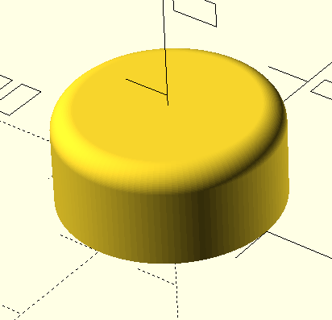
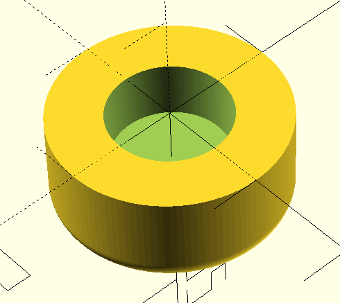

# OpenSCAD script for generating simple stomp caps

/* [Stomp] */
// Height (mm)
Height = 7;
// Radius (mm)
Radius = 10;
// Stomp Switch Radius (mm)
SwitchRadius = 5;
// Stomp switch mount depth (mm)
SwitchDepth = 5;

## Visual

